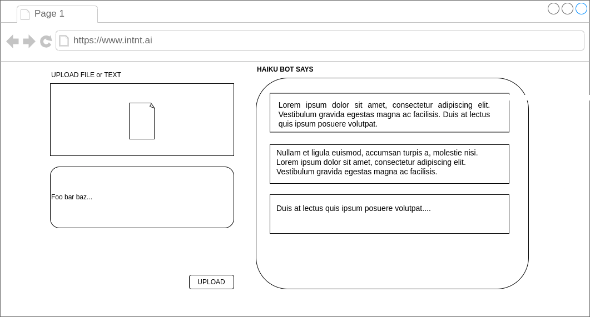

# Intent AI Front End Engineering Challenge - HaikuBot

Welcome to the Intent AI Front End Engineering Challenge. In this challenge, you are tasked with creating a unique frontend experience for HaikuBot, a chatbot that responds with haikus.

The point of this challenge is to judge your ability to write performant code, _not_ write pretty CSS.

## Getting Started

Node and npm should be installed within your development environment.

To set up your development environment and start working on the challenge, run the following commands:

Install the necessary dependencies:
* `npm install`
* `npm install -g nodemon`

Both servers should be running 

Start the development server on port `8080`
* `npm serve`

Start the client server on port `5173`
* `cd haikubot-client`
* `npm install`
* `npm run dev`

note: Please do not modify any of the files found in the `/api` folder.

## Challenge Instructions

Your task is to develop the frontend for HaikuBot, which interacts with a backend server via RESTful APIs. Below are the general instructions and requirements for the challenge.

### Setup

- **Project Structure**: Please organize your frontend code within the dedicated folder in the project repository. This will help maintain a clean and structured codebase.
- **Framework/Library**: Please use Vue 3 to complete this project. 
- **Third-party packages**: We are fine with the usage of third-party component or utility libraries, but no overkill please!

### API Endpoints

Your frontend application should interact with the backend through the following endpoints:

- **[GET] /api/ping**: A simple endpoint to check the server status.
- **[GET] /api/history**: Retrieve available haikus.
- **[POST] /api/update**: Submit new user input to be processed by the backend.
- **[POST] /api/upload**: Upload a text file to be processed by the backend.
- **[GET] /api/converse**: Receive a haiku response.

### Frontend Requirements

1. **User Interface**: Implement a simple user-friendly interface that allows users to interact with HaikuBot. The interface should include:
- A text input for adding new haikus to HaikuBot.
- An option to upload text files containing new haikus for HaikuBot. An example is provided with the project.
- A display area that shows past haikus sent by HaikuBot. A new haiku should be displayed every 7 seconds. Newer haikus are displayed at the top, and older haikues are at the bottom. Only 5 haikus should be visible at any time. The user should be able to scroll to view haikus which are older than the fifth haiku.

2. **Validations**: Implement client-side validations to ensure that user inputs are valid before sending requests to the backend. For example, check for empty inputs or unsupported file types before uploading.

3. **Optimisation**: Apply general pre-processing techniques to optimize the request payload. This might include trimming whitespace, compressing files before upload, or batching requests where appropriate.

4. **Error Handling**: Implement robust error handling to manage and display informative error messages from failed API requests or validation issues.

### Submission Guidelines

- **Code Quality**: Write clean, modular, and well-documented code. Your submission will be evaluated on code quality, including readability, structure, and adherence to best practices.
- **Version Control**: Make regular commits to your repository to demonstrate your development process. Include a INSTRUCTIONS.md file with instructions on how to run your project.

Good luck! We look forward to seeing your innovative solutions and creative interface for HaikuBot.

